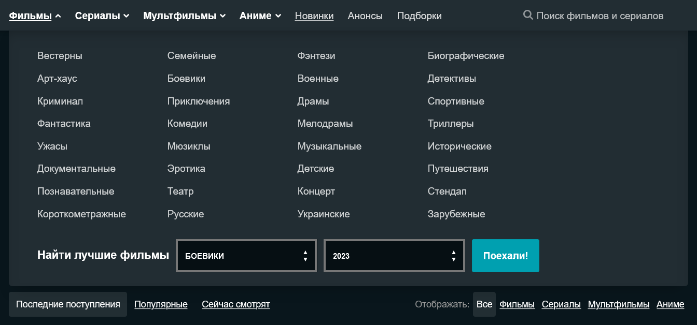

.. _entity-types:

==============
Типы сущностей
==============

Среди множества объектов, с которыми вы будете взаимодействовать в библиотеке, можно выделить несколько основных
сущностей: конструкторы данных, объекты данных и навигаторы.

.. _data-builders:

Конструкторы данных
===================

Основной целью конструкторов данных, как следует из названия, является создание данных, а точнее, объектов данных.
Конструкторы данных преобразуют переданные им данные (зачастую это HTML-код) в объекты данных, с которыми программист
может взаимодействовать без лишних манипуляций с исходными данными.

Конструкторы данных легко отличить по характерной приписке ``"Builder"`` в конце названия класса, например:
``TrailerBuilder``, где первые слова указывают на тип создаваемого ими объекта, в данном случае ``Trailer``. Все
конструкторы данных являются ленивыми, что означает, что они не возвращают никаких данных, пока вы их об этом не
"попросите". Для этого необходимо вызвать метод ``.extract_content()``, который есть у всех конструкторов. Этот
метод не принимает аргументов. Обычно вам не  придётся вызывать этот метод самостоятельно, поскольку библиотека
берёт на себя обязательства его вызова. Однако в редких случаях, таких как с ``TrailerBuilder``, библиотека вернёт
вам именно конструктор, и вам придётся самостоятельно вызвать данный метод. Это необходимо, поскольку после его
вызова будет произведён запрос на сервер для получения URL трейлера, что может быть нерационально в случаях с
автоматическим вызовом, так как может накладывать дополнительные расходы на скорость работы и интернет трафик.

.. code-block:: python

    from HDrezka import HDrezka
    from HDrezka.movie_page_descriptor import MovieDetails

    url = "https://rezka.ag/cartoons/fantasy/45897-legenda-o-vox-machina-2022.html"
    movie: MovieDetails = HDrezka().get(url=url)

    if movie.trailer is not None:
        print(movie.trailer)
        print(movie.trailer.extract_content())

    # >>> 2024-04-01 18:21:55,775 | INFO     | GET request to url = https://rezka.ag/cartoons/fantasy/45897-legenda-o-vox-machina-2022.html with kwargs = {}
    # >>> <TrailerBuilder("45897")>
    # >>> 2024-04-01 18:21:55,675 | INFO     | POST request to url = https://rezka.ag/engine/ajax/gettrailervideo.php with kwargs = {'data': {'id': 45897}}
    # >>> <Trailer(Легенда о Vox Machina / Легенда Вокс Макины)>

.. note::

    Помимо всего, стоит также упомянуть, что ``.extract_content()`` не является единственным методом для извлечения
    данных. Существует множество других методов, соответствующих паттерну ``.extract_*()``, которые зачастую возвращают
    конкретный кусочек данных, например, год выхода или описание фильма, и используются внутри ``.extract_content()``.

Иногда вам может понадобиться преобразовать уже имеющиеся данные в объекты данных. Это довольно просто: конструктор
принимает на вход данные для преобразования, а метод ``.extract_content()`` возвращает готовые для работы объекты. Всё,
что от вас требуется, это создать экземпляр конструктора, передав в него необходимые данные, и вызвать данный метод:

.. code-block:: python

    import requests

    from HDrezka.movie_page_descriptor import MovieDetailsBuilder

    headers = {
        "Host": "rezka.ag",
        "Origin": "https://rezka.ag",
        "Referer": "https://rezka.ag",
        "User-Agent": "Mozilla/5.0 (Windows NT 10.0; Win64; x64; rv:120.0) Gecko/20100101 Firefox/119.0",
        "X-Requested-With": "XMLHttpRequest",
    }

    url = "https://rezka.ag/cartoons/fantasy/45897-legenda-o-vox-machina-2022.html"
    response = requests.get(url, headers=headers, timeout=15)

    builder = MovieDetailsBuilder(html_content=response.text)
    content = builder.extract_content()

    print(builder)
    # >>> <MovieDetailsBuilder>
    print(content)
    # >>> <MovieDetails(Легенда о Vox Machina / Легенда Вокс Макины)>

.. _data-objects:

Объекты данных
==============

Как было описано выше, объекты данных создаются конструкторами и возвращаются в качестве результата их работы. Цель этих
объектов — хранение информации и представление её в удобном для чтения и обработки формате. По сути, они представляют
элементы с обработанной HTML страницы, приведённые к единому стандарту. Как на веб-странице одни элементы могут содержать
другие, так и здесь одни объекты данных могут содержать другие. Условно, объекты данных можно разделить на несколько
подклассов: BriefInfo, ExtendedInfo и default. Примером могут служить PersonBriefInfo, PersonExtendedInfo и Person.

PersonBriefInfo — это неполный вариант класса Person, используемый там, где полный вариант будет излишен, например, нет
необходимости загружать фото актёра, когда нужно только его имя. Подкласс типа default (в данном случае Person) хранит
полную информацию об объекте или представляет его основную страницу, в то время как подкласс ExtendedInfo
(PersonExtendedInfo) предоставляет расширенную или исчерпывающую информацию об объекте.

Все объекты данных являются `датаклассами <https://docs.python.org/3/library/dataclasses.html>`_, за единственным
:ref:`исключением <>`. Хотя основной целью датаклассов является хранение информации, для упрощения взаимодействия с
библиотекой у части объектов данных, имеющих целевой URL, реализованы два метода: ``.get()`` и ``.quick_content()``.
Метод ``.get()`` выполняет запрос к целевому URL страницы, обрабатывает ответ и на его основе возвращает новый объект
данных.

.. code-block:: python

    from HDrezka import HDrezka
    from HDrezka.movie_page_descriptor import MovieDetails

    url = "https://rezka.ag/cartoons/comedy/1982-graviti-folz-2012.html"
    movie: MovieDetails = HDrezka().get(url=url)
    # >>> 2024-04-01 18:21:55,801 | INFO | GET request to url = https://rezka.ag/cartoons/comedy/1982-graviti-folz-2012.html
    print(movie)
    # >>> <MovieDetails(Гравити Фолз / Грэвити Фоллс)>
    poster = movie.recommendations[0]
    print(poster)
    # >>> Poster("Безумные рестлеры")
    new_movie = poster.get()
    # >>> 2024-04-01 18:21:55,704 | INFO | GET request to url = https://rezka.ag/cartoons/comedy/20074-bezumnye-restlery-2011.html
    print(new_movie)
    # >>> <MovieDetails(Безумные рестлеры)>

А метод ``.quick_content()`` вызванный у объекта типа `default` вернёт для него объект типа `ExtendedInfo`:

.. code-block:: python

    from HDrezka import HDrezka
    from HDrezka.movie_page_descriptor import MovieDetails

    url = "https://rezka.ag/cartoons/comedy/1982-graviti-folz-2012.html"
    movie: MovieDetails = HDrezka().get(url=url)
    # >>> 2024-04-01 18:21:55,704 | INFO | GET request to url = https://rezka.ag/cartoons/comedy/1982-graviti-folz-2012.html
    print(movie)
    # >>> <MovieDetails(Гравити Фолз / Грэвити Фоллс)>
    poster = movie.recommendations[0]
    print(poster)
    # >>> Poster("Безумные рестлеры")
    poster_extended_info = poster.quick_content()
    # >>> 2024-04-01 18:21:55,704 | INFO | POST request to url = https://rezka.ag/engine/ajax/quick_content.php with kwargs = {'data': {'id': 20074, 'is_touch': '1'}}
    print(poster_extended_info)
    # >>> PosterExtendedInfo("Безумные рестлеры")

Сам объект данных представлен в виде класса имеющий внутренние поля к которым при необходимости можно обращаться:

.. code-block:: python

    @dataclass
    class Trailer:
        id: int  # Идентификатор фильма
        title: str  # Название фильма
        original_title: str  # Название фильма в оригинале
        description: str  # Описание фильма
        release_year: int  # Год выхода фильма
        trailer_url: str  # Ссылка на трейлер
        url: str  # Ссылка на фильм

.. code-block:: python

    from HDrezka import HDrezka
    from HDrezka.movie_page_descriptor import MovieDetails

    url = "https://rezka.ag/films/action/968-vlastelin-kolec-bratstvo-kolca-2001.html"
    movie: MovieDetails = HDrezka().get(url=url)
    trailer = movie.trailer.extract_content()
    print(trailer)
    # >>> <Trailer(Властелин колец: Братство кольца)>
    print(trailer.title)
    # >>> Властелин колец: Братство кольца
    print(trailer.url)
    # >>> https://rezka.ag/films/action/968-vlastelin-kolec-bratstvo-kolca-2001.html
    print(trailer.trailer_url)
    # >>> https://www.youtube.com/embed/VIgkpEgCV-I?iv_load_policy=3&modestbranding=1&hd=1&rel=0&showinfo=0&autoplay=1
    print(trailer.__dict__)
    # >>> {'id': 968, 'title': 'Властелин колец: Братство кольца', 'original_title': 'The Lord of the Rings: The Fellowsh...

.. _navigators:

Навигаторы
==========

Навигаторы представляют собой сущности, отвечающие за построение корректных URL-запросов и упрощение перемещения по
сайту. Они помогают пользователям ориентироваться в категориях сайта, таких как фильмы, сериалы, анимация и т.д.,
предоставляя способ фильтрации и поиска контента. Сами фильтры повторяют функционал сайта и позволяют пользователям
настраивать такие параметры поиска, как жанры, год выхода или сортировать результаты по популярности, например.

.. _popup_site_navigation:

    Пример элементов навигации на сайте

В коде подобный запрос будет иметь следующий вид:

.. code-block:: python

    from HDrezka import HDrezka
    from HDrezka.filters import GenreFilm

    films = HDrezka().films()
    films = films.find_best(genre=GenreFilm.ACTION, year=2023)
    print(films)
    # >>> https://rezka.ag/films/best/action/2023/
    print(type(films))
    # >>> <class 'HDrezka.site_navigation.Best'>

.. note::

    Обратите внимание что строковое представление навигатора - URL.

Навигаторы представляют собой ленивые сущности, которые выполняют запросы только по явному требованию, что помогает
экономить интернет-трафик и снижать нагрузку на сервер. Для того что бы получить данные от сервера необходимо вызвать
метод ``.get()``.

.. code-block:: python

    from HDrezka import HDrezka

    films = HDrezka().films()
    posters_list = films.get()
    print(posters_list)
    # >>> [Poster("Лесси – лохматый детектив"), Poster("Стражи Галактики. Часть 3"), Poster("Звук свободы"), ...

Поскольку разделы сайта зачастую многостраничные, навигаторы позволяют переходить на конкретные страницы раздела, что
имеет смысл, если известно, на какую страницу нужно попасть. Если же необходимо просто перебрать все доступные страницы,
каждый навигатор является итератором, что позволяет обходить раздел постранично в цикле:

.. code-block:: python

    from HDrezka import HDrezka

    films = HDrezka().films()
    posters_list = films.page(3).get()  # Перейти на третью страницу раздела фильмов
    print(films.current_page)  # Вывести указатель текущей страницы
    print(films.last_page)  # Вывести указатель последней страницы

    # Постраничный обход раздела коллекций.
    for collections in HDrezka().collections():
        for collection in collections:
            for posters in collection:
                for poster in posters:
                    print(poster)

.. attention::

    Данные о номере последней страницы для навигатора будут доступны только после первого вызова метода ``.get()``.